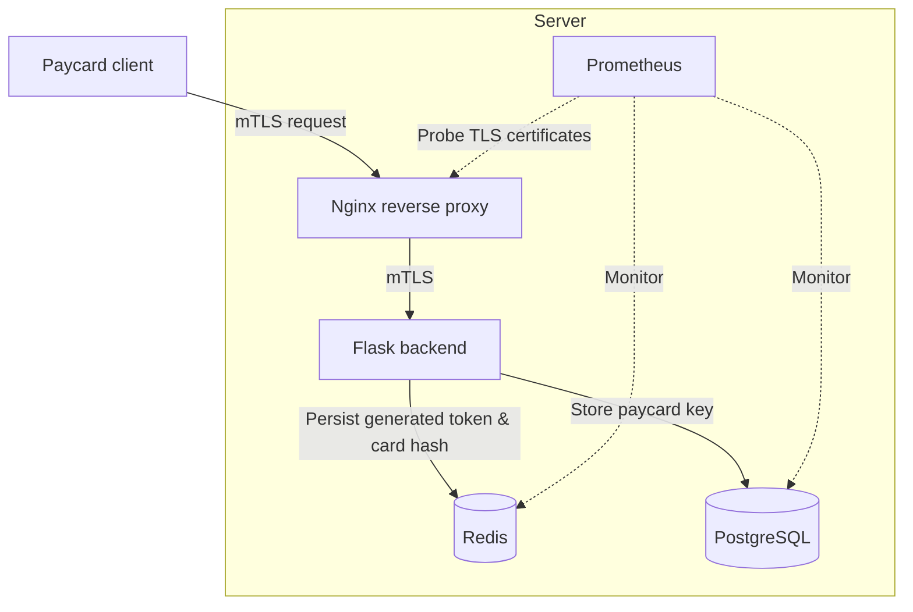

#Secure Payment Gateway Prototype with mTLS & Monitoring [WIP]
## Project Overview
The goal is a secure, high-performance payment gateway prototype designed to simulate banking backend infrastructure. The project focuses on zero-trust network architecture, data persistence, and automated TLS certificate monitoring.

* **Containerization & Orchestration:** Docker, Docker Compose
* **Reverse Proxy / Web Server:** Nginx
* **Backend API:** Python (Flask)
* **Data Layer:** PostgreSQL (Persistent Storage), Redis (Caching & Session Management)
* **Infrastructure & Observability (In Progress):** Internal CA, mTLS (X.509), Prometheus

## Current Status & Roadmap (WIP)
- [x] Architected Nginx reverse proxy and Flask backend integration.
- [x] Implemented card tokenization logic with Redis caching and PostgreSQL 
- [ ] **[In Progress]** Deploying an internal Certificate Authority to enforce strict mTLS between components.
- [ ] **[Next Steps]** Integrating Prometheus&exporters to track and alert on TLS certificate expiration dates.
      

## How to Run (Local Deployment)
The entire infrastructure is containerized so you can start the full environment with a command:

```bash
docker-compose up --build
```


