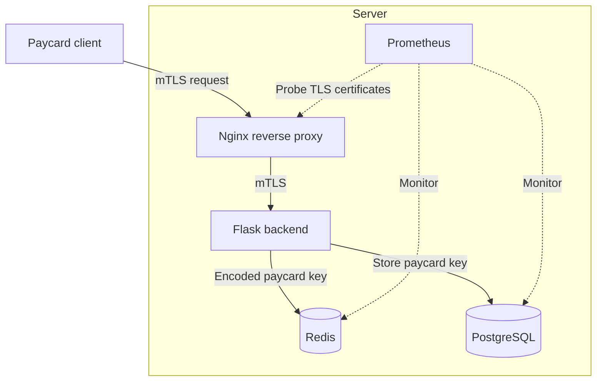

```mermaid
flowchart TD
    Client["Paycard client"] -->|"mTLS request"| Nginx["Nginx reverse proxy"]

    subgraph Server["Server"]
        Nginx -->|"mTLS"| Flask["Flask backend"]
        Flask -->|"Еncoded paycard key"| Redis[("Redis")]
        Flask -->|"Store paycard key"| Postgres[("PostgreSQL")]

        Prometheus["Prometheus"] -.->|"Probe TLS certificates"| Nginx
        Prometheus -.->|"Monitor"| Redis
        Prometheus -.->|"Monitor"| Postgres
    end
```
